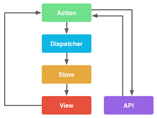

# React + Redux

L'utilisation de Redux va amener une organisation du code qui découple complètement la partie affichage des données de la partie code métier dans les reducers.



## Créer un store avec REDUX

```
npm i --save redux react-redux
```

## 1. Provider
Dans App.js, importer Provider puis le déclarer en passant le store dans les props :
```jsx
import { Provider } from ‘react-redux’

class App extends React.Component {

    render() {

        return (
            <Provider store={store}>
                <div className=”App”>
                </div>
            </Provider>
        )
    }
}

export default App
```

## 2. Créer action.js 

*  Déclarer les actions + import json ou bdd

```jsx
import base from ...
const FETCH_CREATIVES_REQUEST = ‘FETCH_CREATIVES_REQUEST’
//...
```

*  Fonction fetch qui retourne une fonction anonyme avec dispatch en param

```jsx
function fetchCreatives() {
    return function(dispatch) {
    dispatch({type: FETCH_CREATIVES_REQUEST})
    base.ref(‘/creatives’).once(‘value’)
    .then(creatives => dispatch({type: FETCH_CREATIVES_SUCCESS, payload: 
    creatives.val()}))
    .catch(error => dispatch({type: FETCH_CREATIVES_FAILURE, payload: 
    error}))
    }
}
```

*  Déclarer les autres actions et leur payload

```jsx
function clickPage(number) {
	return { type: PAGE_SELECTED, payload: number }
}
function filterCreatives(filter, checked) {
	return { type: FILTER_CREATIVE, filter, checked }
}
//...
```

*  Exporter les actions
```jsx
export { 
    FETCH_CREATIVES_REQUEST, 
    FETCH_CREATIVES_SUCCESS,
    //...
}
```

## 3. Créer le reducer.js

*  Importer les actions (+ bdd pour gérer actions CRUD)
*  Créer obj initialState
```jsx
const INITIAL_STATE =  { 
    creatives: null,
    isFetching: false, 
    error: null,
    //...
}
```
*  Exporter le store et gérer les actions, donner au state en valeur par défaut INITIAL_STATE

```jsx
export default function creative(state = INITIAL_STATE, action) {
    switch (action.type) {
        case FETCH_CREATIVES_REQUEST:
        {
            return {
                ...state,
                isFetching: true
            }
        }
        case … 	//SUCCESS, FAILURE, ….
        default: { return state }
        }
}
```

## 4. Créer store.js

```jsx
import {createStore, combineReducers, applyMiddleware} from ‘redux’
import thunk from ‘redux-thunk’
import creative from ‘./creative.reducer’
```

* Combiner les reducers
```jsx
const reducers = combineReducers({
    creative
})
```

* Passer les reducers combinés en param + applyMiddleware
```jsx
const store = createStore(
    reducers,
    applyMidleware(thunk)
)
```

* Exporter

```jsx
export default store
```

## 5. Importer le store dans le component

```jsx
import { connect } from ‘react-redux’
import { fetchCreatives } from ‘./store/creative.actions’
```

*  Connecter le store

```jsx
componentDidMount() {
    this.props.fetchCreatives()
}
```

*  Passer le store dans les props

```jsx
function mapStateToProps(store) {
    return { creative: store.creative }
}
```

>Accès aux clés du state :  
>`const { creatives } = this.props.creative`

*  Dispatch des actions

```jsx
function mapDispatchToProps(dispatch) {
    return {
        fetchCreatives: () => dispatch( fetchCreatives() ),
        //...
    }
}
```

*  Exporter via connect
```jsx
import { connect } from 'react-redux'
    ...
export default connect(mapStateToProps, mapDispatchToProps)(monComponent)
```
